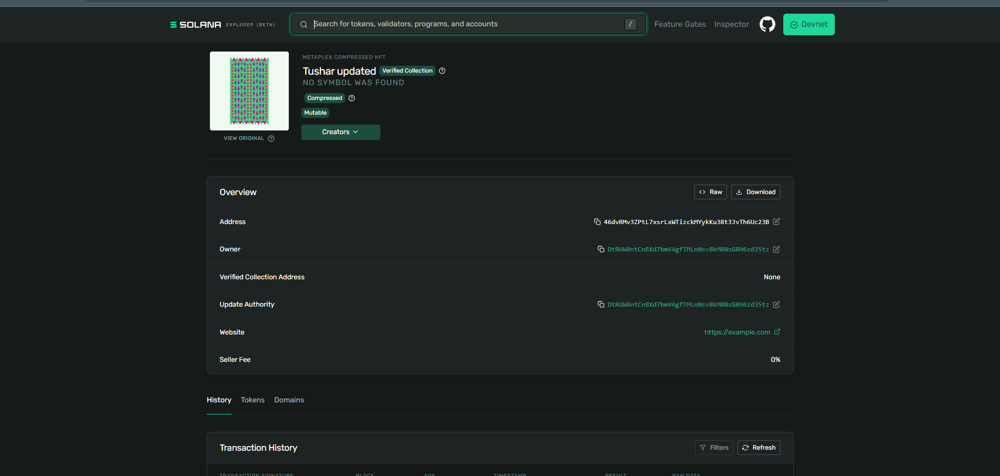
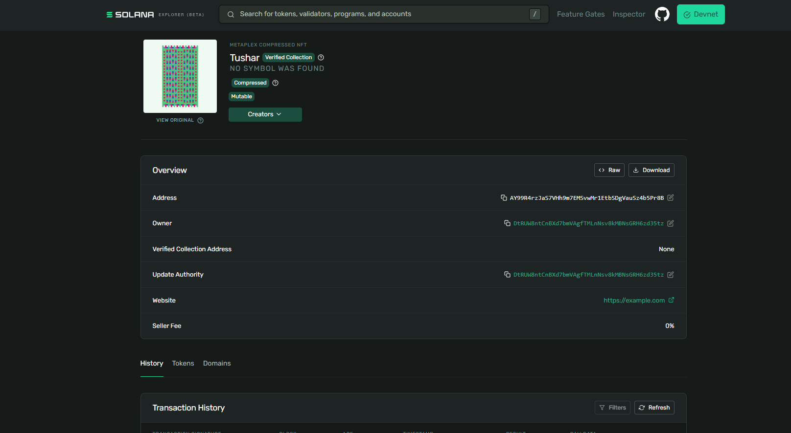
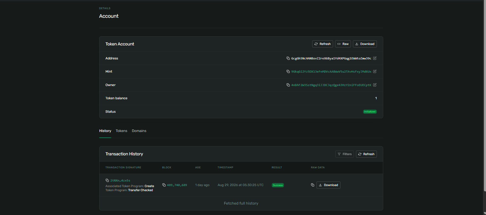

# Turbin3 Week 1 — SPL Token & MPL Core NFT

This repository demonstrates core Solana Devnet token and NFT operations:

1. Mint and transfer a custom SPL token.
2. Mint an NFT using Metaplex Core (MPL Core).
3. Update the NFT name and metadata using the update authority.

The repository also includes supporting Solana Explorer screenshots as proof of the on-chain results.

## Setup

Install dependencies:

```bash
npm install
```

Configure Solana CLI for Devnet:

```bash
solana config set --url devnet
```

Check the configured wallet:

```bash
solana address
solana balance
```

Fund the wallet with Devnet SOL if required:

```bash
solana airdrop 2 --url devnet
```

> Never commit your wallet/keypair JSON to GitHub. Keep it in `.gitignore`.

---

# Tasks

## 1. Mint and Transfer SPL Token

The SPL token workflow creates a token mint, mints tokens to the wallet's associated token account (ATA), and transfers tokens to another ATA.

### Commands

If the project contains the SPL token script:

```bash
npx tsx src/Spl-token/spl_init.ts
```

If token metadata is included:

```bash
npx tsx src/Spl-token/spl_metadata.ts
```

The SPL token metadata script adds token metadata such as name, symbol, and URI through the Token Metadata program.

### What was demonstrated

- Created a custom SPL token mint.
- Minted token supply.
- Created/used associated token accounts.
- Transferred tokens to another wallet/ATA.
- Verified the resulting token account and transaction on Solana Explorer.

### Explorer proof

The screenshot below shows the token account with:

- Token balance: **1**
- Status: **Initialized**
- A successful transaction containing **Token Program: Transfer Checked**



---

# 2. Mint an NFT Using MPL Core

The NFT is minted using **Metaplex Core**.

Unlike legacy Token Metadata NFTs, a Core NFT uses a Core asset account rather than requiring the traditional separate mint, metadata, and master-edition accounts.

### Command

```bash
npx tsx src/NFT/nft_mint.ts
```

### What was demonstrated

- Created an MPL Core NFT on Solana Devnet.
- Set the NFT name and metadata.
- Assigned the wallet as owner/update authority.
- Verified the asset on Solana Explorer.

### Explorer proof

The Explorer identifies the asset as:

```text
METAPLEX COMPRESSED NFT
```

The NFT name shown in the proof is:

```text
Tushar
```

The asset is also shown as:

```text
Compressed
Mutable
```



---

# 3. Update NFT Name and Metadata as Update Authority

The NFT update script uses the wallet holding the NFT's **update authority** to modify the asset.

### Command

```bash
npx tsx src/NFT/nft_update.ts
```

The update operation changes the NFT name and metadata URI using the same update-authority wallet.

### What proves the update?

The final Solana Explorer proof shows:

- NFT name changed to **Tushar updated**
- Asset remains **Mutable**
- Update Authority is displayed
- NFT transaction history is available



---

# On-Chain Proof Summary

| Task | Proof | Result |
|---|---|---|
| SPL Token mint | Solana Explorer | Token account created |
| SPL Token transfer | Transaction History | `Transfer Checked` — **Success** |
| MPL Core NFT mint | Solana Explorer | NFT created successfully |
| NFT mutability | Explorer asset details | **Mutable** |
| NFT metadata update | Explorer asset details | Name changed to **Tushar updated** |
| Update authority | Explorer asset details | Authority displayed |

---

# Important Addresses from Explorer Proof

## SPL Token

### Mint

```text
9GkqGi2Yz5DX13eFnMDVcAA8WwV5u2TAvHsFxyJMd6Ux
```

### Token Account

```text
GcgGh5NcHAN8ovZ2reX6Bya1Yd4XPGqg1EWwItoZmw39c
```

## MPL Core NFT

### NFT Address shown in the creation proof

```text
AY99R4rzJaS7VhH9m7EMSvwr1EtbSDgVauSz4b5Pr8B
```

### NFT Address shown in the final update proof

```text
46dvRMv3ZPtL7xsrLxWItzickMYykKu38t3JvTh6Uc23B
```

### Update Authority

```text
DtRUW8ntCnBXd7bmVAgFTMLnNsv8kMBNsGRH6zd35tz
```

### Metadata Website shown by Explorer

```text
https://example.com
```

---

# Repository Structure

Adjust the structure below to match the actual files in the repository:

```text
src/
├── Spl-token/
│   ├── spl_init.ts
│   └── spl_metadata.ts
│
└── NFT/
    ├── nft_mint.ts
    └── nft_update.ts

proof/
├── task1-spl-token-proof.png
├── task2-nft-mint-proof.png
└── task3-nft-update-proof.png
```

---

# Verification on Solana Explorer

To independently verify the work:

1. Open Solana Explorer.
2. Select **Devnet**.
3. Search the token mint, token account, NFT address, or transaction signature.
4. Verify the account/asset information.
5. Check the transaction result for successful execution.

The screenshots in the `proof/` directory provide visual evidence of the completed Devnet operations.

---

# Workflow

```text
Create SPL Token
       ↓
Mint Token
       ↓
Transfer Token
       ↓
Create MPL Core NFT
       ↓
Set NFT Metadata
       ↓
Use Update Authority
       ↓
Update NFT Name / Metadata
       ↓
Verify on Solana Explorer
```

## Conclusion

This project demonstrates the basic Solana asset lifecycle required for Turbin3 Week 1:

- SPL token creation and minting
- SPL token transfer
- MPL Core NFT creation
- NFT metadata management
- NFT update-authority functionality
- On-chain verification using Solana Explorer

All demonstrated assets were verified on **Solana Devnet**.
